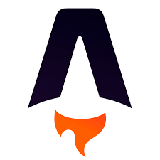
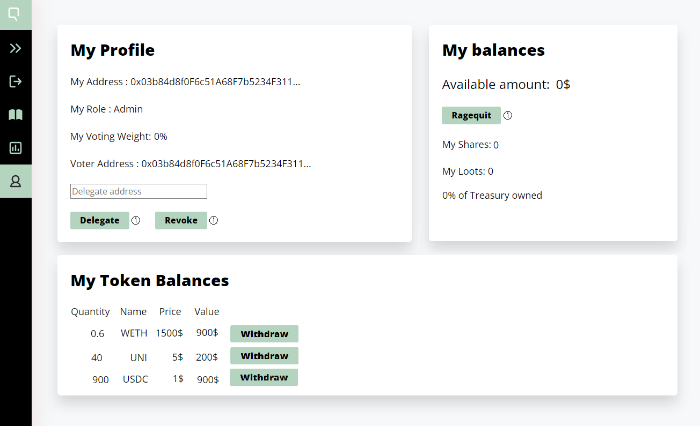

# Architecture overview

## Technical Stack

* Front-end : Client-only Webapp - Astro
* Back-end : Hosted, read-only, relies on indexing : Apibara , MongoDB , GraphQL
* Smart Contrats : Cairo  Starknet 

## Smart Contracts&#x20;

Like Moloch V2, the DAO is deployed as a single contract. Although not strictly necessary, it can deployed as an upgradeable contract through a proxy.

The DAO's contract follows a modular design that allows to (i) incorporate only the modules that are needed (ii) extend existing functionalities with new modules (implementing a minimal interface). This departure from Moloch V2 gives the DAO extra flexibility allowing to personalise its functionalities while keeping a simple maintainable design.

<figure><figcaption></figcaption></figure>

Unlike Moloch V2, every type of proposal has its own module separatedly implementing submiting and processing logic. One of the reasons to do so is to make their lifecycle more configurable, especially regarding role-based autorisation on a per type basis. For example in Alpha version, only Admins are allowed to onboard a new member, as other members are not legally accountable for that action.
