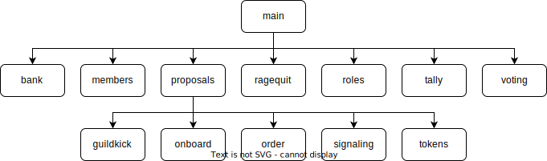

# Architecture

## Overview

* Front-end : Serverless - Astro
* Back-end : Hosted, read-only, relies on indexing : Apibara, MongoDB

## Modules

<figure><figcaption>
Modules Hierarchy
</figcaption></figure>
