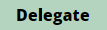
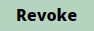

# Your Member profile

The **"My Profile" page** allows to manage & monitor your membership in the DAO. &#x20;

<figure><figcaption></figcaption></figure>

Several indicators are currently available :&#x20;

* **My Profile** : your address, role, voting weight and the [voter address of your voting right ](your-member-profile.md#the-voting-rights-delegation)
* **My Balances** : the available amount you can[ redeem by using the "Ragequit" function](../redeem-your-shares.md), the prorata shares of Treasury you own and your Shares & Loots
* **My Token Balances** : the current amount of tokens and their values in the Treasury according to the prorata shares of Treasury you own

### The voting right Delegation 

The **Delegate function** ( button) allows to delegate all your voting weight to another address. It can be useful if you have several addresses within the DAO or you are not able to participate for a certain period of time and want to delegate your rights to a trusted person.

By default, the voter address is your own address until you delegate it. The delegation can be revoked at any time by using the **Revoke function** ( button).


Currently, the delegation is only authorized between members who have the same role to lower attack surfaces.


