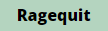

# Redeem your shares

You can **redeem your shares at any time** by "rage quitting" the DAO. Instant redeemability allows to minimize exit costs and ensures a strong protection of shareholding rights.&#x20;

### The Ragequit function

The **Ragequit function** ( button) allows to withdraw the tokens from the Treasury (according to your prorata owned) against the burnt of your Shares & Loots.

The function can be executed only if you have available amount to ragequit AND you did not voted YES on a proposal that has been not executed yet.

<figure><figcaption></figcaption></figure>

Once the Ragequit function is executed, you can withdraw your tokens by using the button.


Currently, the Ragequit function allows to only withdraw 100% of the available amount. Partial ragequit is yet to be implemented.

