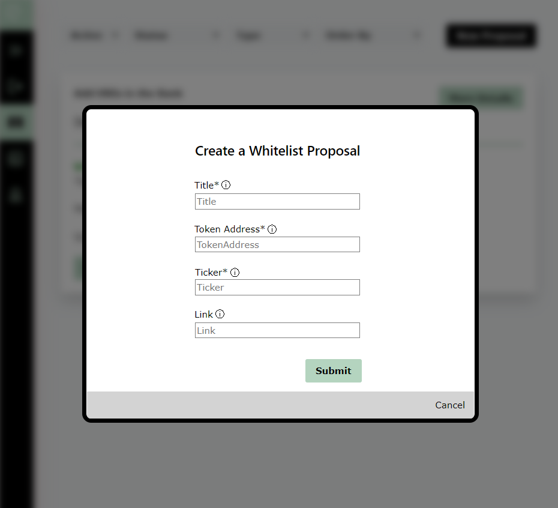

# 🔊 Create a Proposal

Suppose we want to invest in UNI tokens. We have to add UNI tokens to the treasury, which has to go through at least 2 proposals:

* One **Whitelist Proposal** to authorize UNI tokens with the _Bank_
* One **Swap Proposal** to **** add UNI tokens to the treasury


A **Signal Proposal** allows to create an on-chain poll that does not execute anything. It can be submitted before any proposal to get a preventive feedback from the DAO.


<figure><figcaption>
To <strong>create a New Proposal</strong>, click on the button at the top-right of the homepage.
</figcaption></figure>

## Create a Whitelist Proposal

A token has to be whitelisted with the _Bank_ before it can be added to the DAO.&#x20;

A Whitelist Proposal allows to **whitelist a token address in the DAO Treasury**.

<figure><figcaption></figcaption></figure>

When you create a Whitelist Proposal, several parameters are needed:

* Title : the title of your Proposal.
* Token Address : the address of the token you want to whitelist.
* Ticker : the name of the token that will be displayed in the DAO, such as "UNI".
* Link (not mandatory) : a link from the off-chain discussions on the Proposal.


A list of whitelisted tokens can be enforced by the Admin during the initialization of the DAO.


## Create a Swap Proposal

A Swap Proposal allows to **swap a certain amount of tokens from the Treasury against a certain amount of tokens to the Treasury**.

There are 2 types of Swap Proposals :&#x20;

* **OTC Swap :** an authorized address can send tokens to the Treasury against tokens from the Treasury.
* **AMM Swap** (yet to be implemented) : the Treasury swaps tokens by directly interacting with an Automated Market Maker.

<figure><figcaption></figcaption></figure>

When you create a OTC Swap Proposal, several parameters are needed:

* Title : the title of your Proposal.
* Send to the Bank : amount of a specific token you want to send to the Treasury (_only whitelisted tokens are displayed_)
* Receive from the Bank : amount of a specific token you want to receive from the Treasury
* The Link (not mandatory) : a link from the off-chain discussions on the Proposal.

## Proposal Workflow

A Proposal follows a complex lifecycle that ensures **fairness** and reduces **surface attacks** _(especially a 51% attack on minority shareholders)._

The lifecycle of a Proposal is the following :&#x20;

* Submitted : the Proposal is created and enters the "**Voting Period**" during which all authorized members can vote.
* Accepted : at the end of the "Voting Period", if the **Quorum** & **Majority** requirements are met, the Proposal enters a **"Grace Period"** during which all members who did not voted YES can [leave the DAO](redeem-your-shares.md) if they disagree with the vote.
* OR Rejected : the Proposal is rejected if the Quorum & Majority requirements are not met at the end of the Voting Period.
* To Process : when the Grace Period ends, any authorized member is able to process the Proposal.
* Processed: the Proposal is executed when an authorized member processes it.


If a Proposal type is set as "**Admin only**", the Proposal is **enforced** and directly enters the Grace Period.


##

