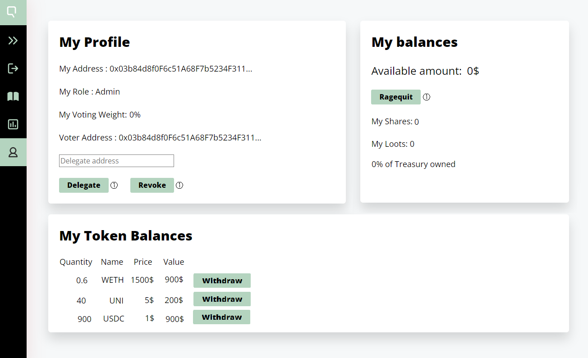

# 🔊 Create a Proposal

The investments made by the DAO are triggered through proposals. Suppose we want for example to invest in UNI tokens. We have to add UNI tokens to the treasury, which has to go through at least 2 proposals:

* One **Whitelist Proposal** to authorize UNI tokens with the _Bank_
* One **Swap Proposal** to **** add UNI tokens to the treasury


A **Signal Proposal** can also be used to create an on-chain poll that does not execute anything. It can be submitted before any proposal to get a preventive feedback from the DAO.


To **create a New Proposal**, click on the button  at the top-right of the homepage:

<figure><figcaption></figcaption></figure>

## Create a Whitelist Proposal

A **token** has to be **whitelisted with the **_**Bank**_ before it can be added to the DAO. This is done with a Whitelist Proposal:

<figure><figcaption></figcaption></figure>

A Whitelist Proposal has the following parameters:

* **Title**: Proposal's title.
* **Token Address**: proposed token's address to whitelist.
* **Ticker**: the name of the token that will be displayed in the DAO, such as "UNI".
* **Link** (optional):  a link to an off-chain discussion thread on the proposal.


A list of whitelisted tokens can be enforced by the Admin during the initialization of the DAO.


## Create a Swap Proposal

A Swap Proposal allows to **exchange tokens from the Treasury against other tokens.**

There are 2 types of Swap Proposals :&#x20;

* **OTC Swap :** a member can exchange tokens from his/her account with tokens from the Treasury.
* **AMM Swap** (yet to be implemented) : the Treasury swaps tokens through an Automated Market Maker.

<figure><figcaption></figcaption></figure>

When you create a OTC Swap Proposal, several parameters are needed:

* **Title**: Proposal's title
* **Send to the Bank**: amount to send to the Treasury in the specified (_whitelisted_) token.
* **Receive from the Bank**: amount to receive from the Treasury in the specified token.
* **The Link** (_optional_): a link to an off-chain discussion thread on the proposal.

## Proposal Workflow

A proposal's lifecycle ensures **fairness** and reduces **surface attacks** _(especially a 51% attack on minority shareholders)_ and consists of the following possible states:

* **Voting Period**: the Proposal is created and enters the **Voting Period** during which authorized members can vote.
* **Grace Period**: at the end of the Voting Period, if the **Quorum** & **Majority** requirements are met, the Proposal enters a **Grace Period** during which members who did not voted for the proposal can [leave the DAO](redeem-your-shares.md) if they disagree with the proposal.
* OR **Rejected to be processed**: the Proposal is rejected if the Quorum & Majority requirements are not met at the end of the Voting Period.
* **Approved to be processed**: when the Grace Period ends, any authorized member can process the Proposal in order to be executed.
* **Approved** : a Proposal has been approved and processed.
* **Rejected**: a Proposal has been rejected and processed.


If a Proposal type is set as "**Admin only**", the Proposal is **enforced** and directly enters the Grace Period.

